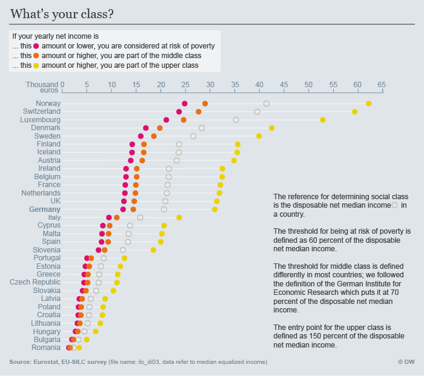

# What's your class?
The goal was to give users a chance to determine to what class they belong

### Data Source
Eurostat [ilc_di03](http://ec.europa.eu/eurostat/en/web/products-datasets/-/ILC_DI03)

### Definitions
* People are determined **at risk of poverty** when they earn less than the disposable median net income of their country
* People belong to the **middle class** when they earn at least 70% of the disposable median net income of their country
* People belong to the **upper class** of their country once their disposable net income exceeds 150% of the median

Note: The "at risk of poverty" is commonly defined in the above way, the other two however are set differently from country to country. We followed the definition by the German Institute for Economic Research (DIW) [see Wikipedia Reference](https://de.wikipedia.org/wiki/Mittelschicht#cite_note-DIW_2010-24-1-11) and the [original source](http://www.diw.de/documents/publikationen/73/diw_01.c.357505.de/10-24-1.pdf)

Eurostat defines the **Disposable net income** like this: "(It's) is the total gross disposable income (i.e. all income from work, private income from investment and property, transfers between households and all social transfers received in cash including old-age pensions) minus social security contributions and income taxes payable by employees."

[More information can be found here](http://ec.europa.eu/eurostat/statistics-explained/index.php/Glossary:Equivalised_disposable_income)

### Methodology
Based on the median income we calculated the thresholds according to the above definitions with Python. Next, we sorted and exported that data as a new csv file and visualized it with help d3.js. Finishing touches to the design were implemented with Adobe Illustrator.

### Output

